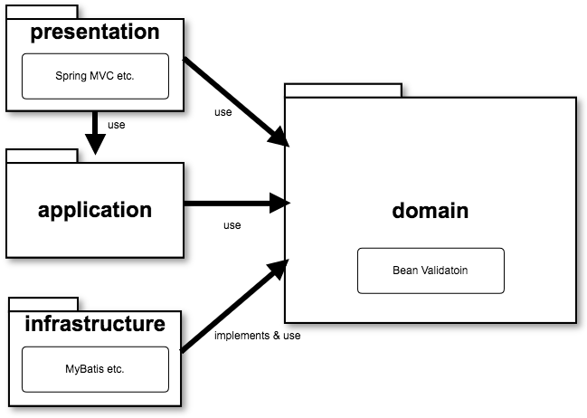

# ドメインを独立させる Isolating the Domain

- Spring Boot
- Spring MVC (direct field access)
- MyBatis SQL Mapper

## 初期設定

```sh
make init
```

## bash

```
make bash
```

## 起動方法

```sh
./gradlew bootRun
```

## 実行可能 Jar のビルドと実行

```sh
./gradlew clean build
java -jar webapp/build/libs/webapp.jar
```

## 設計ガイド

[ドメイン駆動設計本格入門](https://www.slideshare.net/masuda220/ss-137608652)

[型指向のプログラミング：設計ガイドライン](https://github.com/masuda220/business-logic-patterns/wiki/%E8%A8%AD%E8%A8%88%E3%82%AC%E3%82%A4%E3%83%89%E3%83%A9%E3%82%A4%E3%83%B3)

[書籍：現場で役立つシステム設計の原則](https://gihyo.jp/book/2017/978-4-7741-9087-7)

## アーキテクチャ


